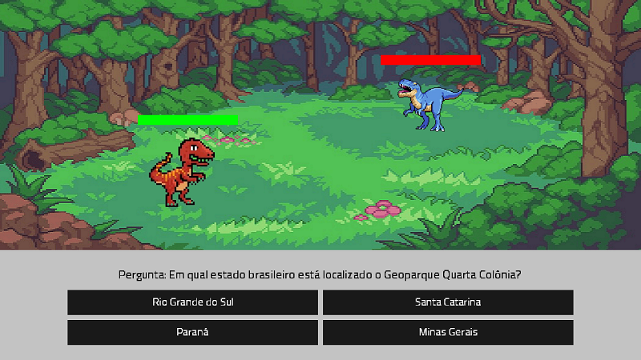
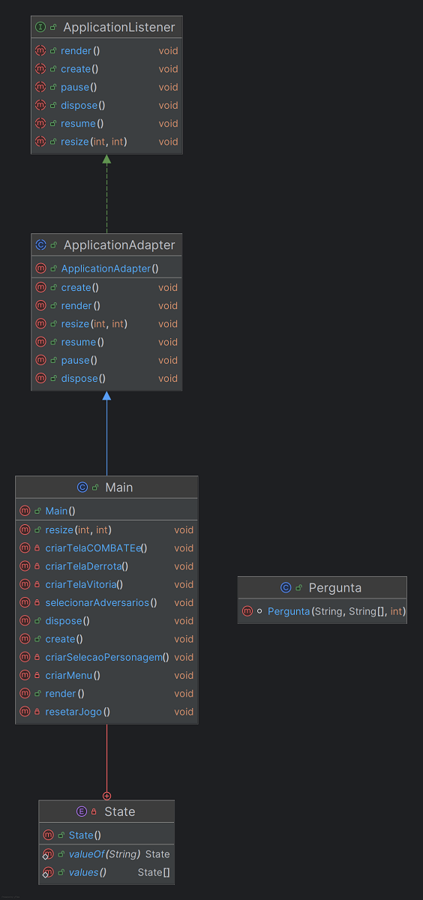

# Projeto final de programação orientada a objetos

**Nome:** João Henrique Scherer Wolski \
**Curso:** Sistemas de informação

Nesse projeto final da disciplina de paradigmas de programação foi desenvolvido o jogo **DinoZ**, um jogo de combate em turnos no qual o jogador cada rodada recebe uma pergunta com a temática dos Geoparques da região central do RS e, no caso de acerto, causa dano ao adversário e no caso de erro sofre dano do adversário. O jogo foi desenvolvido em Java utilizando o framework libGDX.

## Processo de desenvolvimento

Inicialmente tive certo receio para decidir o tema do meu jogo, pois não queria fazer algo simplório nem tentar fazer demais e me complicar. Acabei chegando na ideia de desenvolver um jogo no estilo "Pokémon" que encaixa bem com a temática dos Geoparques de Caçapava do Sul e da Quarta Colônia. Após o fim do "processo criativo" comecei a testar algumas ideias com a libGDX e logo percebi que seria um processo muito mais agradável do que a experiência que eu tive com a biblioteca de C Allegro. \
Os **primeiros 2 commits** representam apenas a instalação da libGDX, já no **3º commit** comecei o desenvolvimento do jogo adicionando um menu com botões "Jogar" e "Sair" funcionais, além de adicionar a imagem que viria a ser o plano de fundo do combate do jogo. Nessa primeira versão ao invés de basear o jogo em 5 possíveis estados como é o caso da versão final, fiz apenas um estado que seria `jogo_iniciado`. \
No **4º commit** adicionei a lógica básica do jogo. Ela sofreu apenas pequenas modificações desse ponto até a versão final. 
```java        
    ClickListener listener = new ClickListener() {
    @Override
    public void clicked(InputEvent event, float x, float y) {
        TextButton botao = (TextButton) event.getListenerActor();
        if (botao.getText().toString().equals(pergunta.opcoes[pergunta.resposta_correta])) {
            vida_adversario -= 10;
        } else {
            vida_jogador -= 10;
        }

        if (vida_jogador <= 0) {
            dinossauro_atual++;
            if (dinossauro_atual < 3) {
                vida_jogador = 100;
                criarTelaCombate();
            } else {
                estado_atual = State.DEFEAT;
                criarTelaDerrota();
            }
        } else if (vida_adversario <= 0) {
            adversario_atual++;
            if (adversario_atual < 3) {
                vida_adversario = 100;
                criarTelaCombate();
            } else {
                estado_atual = State.VICTORY;
                criarTelaVitoria();
            }
        } else {
            pergunta_atual = (pergunta_atual + 1) % perguntas.length;
            criarTelaCombate();
        }
    }
};
```
Após implementar a lógica de combate comecei a implementação dos assets, por algum motivo eu não conseguia adicionar mais nenhuma imagem além da imagem de fundo, então adicionei 2 círculos para representar os jogadores e pesquisei uma maneira simples de fazer uma barra de vida. 
```java

public void render() {

        ScreenUtils.clear(0f, 0f, 0f, 1f);

        if (estado_atual == State.COMBAT) {
            lote.begin();
            lote.draw(textura, 0, 0, 1280, 720);
            lote.end();

            shapeRenderer.begin(ShapeRenderer.ShapeType.Filled);
            shapeRenderer.setColor(0, 0, 1, 1); 
            shapeRenderer.circle(300, 360, 50); // Círculos para representar os jogadores
            shapeRenderer.setColor(1, 0, 0, 1);
            shapeRenderer.circle(980, 360, 50); // Círculos para representar os jogadores

            shapeRenderer.setColor(0, 1, 0, 1);
            shapeRenderer.rect(200, 650, vida_jogador * 2, 20); // Barra de vida, quando a vida do jogador diminui ela diminui também, extremamente simples

            shapeRenderer.setColor(1, 0, 0, 1);
            shapeRenderer.rect(880, 650, vida_adversario * 2, 20); // Barra de vida, quando a vida do jogador diminui ela diminui também, extremamente simples

            shapeRenderer.end();
        }

        palco.act(Gdx.graphics.getDeltaTime());
        palco.draw();
    }

    @Override
    public void resize(int largura, int altura) {
        palco.getViewport().update(largura, altura);
    }
```
No **5º commit** adicionei imagens reais dos dinossauros que eu selecionei para o jogo, porém não achei que elas combinavam com a estética do jogo e acabei removendo. \
Nos **commits 6 e 7** fiz a troca das imagens reais por imagens stock de dinossauros que tivessem um estilo mais retrô (8 ou 16 bits), também adicionei ao vetor de strings as perguntas que seriam utilizadas no jogo, além de colocar música e corrigir alguns detalhes como tamanho de fonte e posição de imagens. \
Por fim, no **9º commit**, para relacionar mais meu trabalho com os conceitos de POO fiz algumas alterações no projeto com destaque para a adição da classe Pergunta.

## Link para jogar


\
**O jogo está disponível para jogar via web no site itch.io**. [Link do jogo](https://joaohsw.itch.io/dinoz)

## Diagrama de classes



## Referências
[Wiki da libGDX](https://libgdx.com/wiki/) \
[Subreddit da libGDX (muitas postagens)](https://www.reddit.com/r/libgdx/) \
[libGDX no StackOverflow](https://stackoverflow.com/questions/tagged/libgdx) \
[Raeleus no YouTube](https://www.youtube.com/@raeleus/videos) \
[Yassa Taiseer no Youtube](https://www.youtube.com/@YassaTaiseer/featured)


